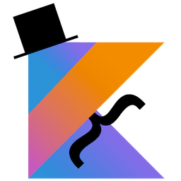

# oh-my-mustache

[](https://travis-ci.org/ekino/oh-my-mustache)
[](https://github.com/ekino/oh-my-mustache/releases)
[](https://github.com/ekino/oh-my-mustache/blob/master/LICENSE.md)

A command line tool to fill [Mustache](https://mustache.github.io/) templates written in [Kotlin](https://kotlinlang.org/).

## Slides

This project is a demo subject to show how to write a command line tool from the first line of code to the installation on the user system.

Slides are available at : [http://slides.com/ekino-leomillon/oh-my-mustache](http://slides.com/ekino-leomillon/oh-my-mustache/fullscreen)

## Overview

Fill a simple template :

```
$ oh-my-mustache --template "Hi {{name}} !" --variable name "John Doe"

Hi John Doe !
```

Or using template/context files :

template.mustache
```
Hi {{contact.firstname}} {{contact.lastname}} !
You have these events today :
{{#events}}
    - {{title}}
{{/events}}
```

context.json
```
{
  "contact": {
    "lastname": "Doe",
    "firstname": "John"
  },
  "events": [
    {
      "title": "Meeting 1"
    },
    {
      "title": "Meeting 2"
    }
  ]
}
```

```
$ oh-my-mustache --template-file ./template.mustache --context-file ./context.json

Hi John Doe !
You have these events today :
    - Meeting 1
    - Meeting 2
```

## Installation

### Via Homebrew

You can tap the ekino repository [ekino/formulas](https://github.com/ekino/homebrew-formulas) to install oh-my-mustache.

Just use the following commands :
```
brew tap ekino/formulas
brew install oh-my-mustache
```

> :information_source: Bash / ZSH auto completion will be installed but may not be activated/loaded.
Please follow the instructions written during the homebrew installation or jump the the manual installation section.

### Manual installation

First step, you have to download the latest release (`oh-my-mustache-VERSION.zip` or `oh-my-mustache-VERSION.tar` files) on this [page](https://github.com/ekino/oh-my-mustache/releases/latest).

#### Linux / Mac OS X

Once the archive has been uncompressed, you will find the `oh-my-mustache` script in the `bin` directory.

Go into the `bin` directory and try the following command to get the global help :
```
./oh-my-mustache --help
```

#### Auto completion Bash / ZSH

You can source the script `ohmymustache-completion.bash` in the `completion` directory :
```
source completion/ohmymustache-completion.bash
```

If you want enable it permanently, you will have to load it with your profile. Add the following line to your `~/.bash_profile` or `~/.zshrc` and replace `PATH_TO_TOOL` with the location of the oh-my-mustache uncompressed folder.
```
[ -f PATH_TO_TOOL/completionohmymustache-completion.bash ] && source PATH_TO_TOOL/completion/ohmymustache-completion.bash
```

:information_source: ZSH users : you may need to add these two lines before the previous one to enable the bash completion :
```
autoload -U compinit && compinit
autoload -U bashcompinit && bashcompinit
```

#### Windows

Once the archive has been uncompressed, you will find the `oh-my-mustache.bat` script in the `bin` directory.

Go into the `bin` directory and try the following command to get the global help :
```
oh-my-mustache.bat --help
```
